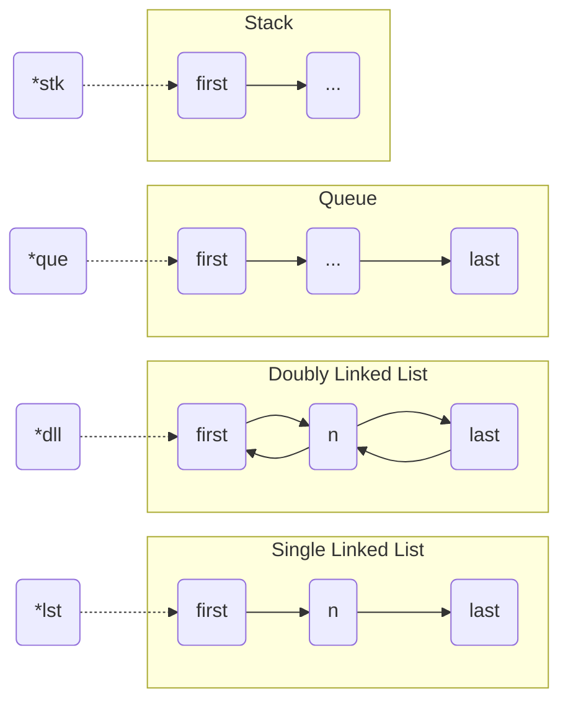
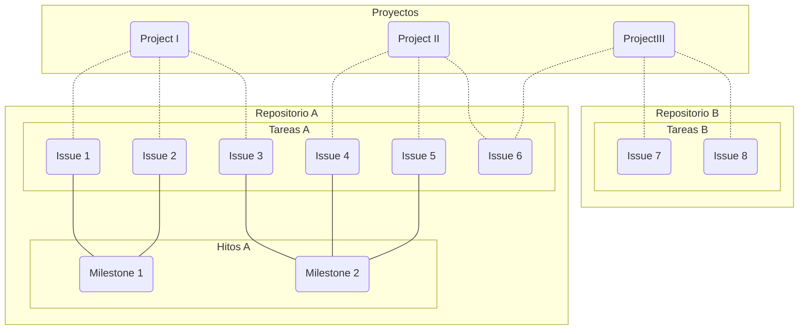

    <h1>gt_datalib</h1>

    
Porque las listas no son suficientes.

---

# I. Introducción

Las estructuras de datos son una parte fundamental de cualquier lenguaje de programación, y en este proyecto vas a aprender a implementar y a usar las siguientes:

|                 Estructura de datos                 |              Tipo               | Descripción                                                                               |
|:---------------------------------------------------:|:-------------------------------:|:----------------------------------------------------------------------------------------- |
| Lista Doblemente Enlazada *(Doubly Linked List)* |             Lineal              | Cada elemento apunta al anterior y al siguiente. Puede accederse a cualquier elemento. |
|                  Cola *(Queue)*                  | FIFO *(First In, First Out)* | Cada elemento apunta al siguiente. Puede accederse solo al primer y último elemento.   |
|                  Pila *(Stack)*                  | LIFO *(Last In, First Out)*  | Cada elemento apunta al siguiente. Puede accederse solo al primer elemento.            |
|                 Conjunto *(Set)*                 |            No lineal            | Cada elemento apunta al siguiente. No admite elementos repetidos.                      |

Además, si todo sale bien, ¡luego podrás incluirlas en tu Libft!

# II. Instrucciones generales

Este proyecto seguirá la misma dinámica que cualquier otro proyecto del *cursus*: reglas del *Makefile*, *Norma*, etc; no obstante, para este proyecto en particular se añadirá algo nuevo, **un buen uso de Git y GitHub**:
- Se debe aplicar el *Flujo de Trabajo de Git* al desarrollo.
- Se deben usar los recursos de GitHub para gestionar el proyecto.
- Se realizará en equipos de 3 personas, formados por aquellos en la misma fila.

> Será necesario repartir las tareas del proyecto entre los miembros del equipo para poder terminarlo a tiempo.

# III. Resultados esperados

**Un uso correcto de Git y GitHub durante el desarrollo del proyecto.**  
Este taller no trata sobre *lenguaje C*; así que lo importante no será el resultado final, sino el proceso.
Se espera un repositorio que contenga:
- ***Commits*** relevantes y estructurados.
- **Ramas** bien definidas que reflejen trabajo en equipo.
- ***Issues*** y ***milestones*** que agrupen tareas.
- ***Projects*** que gestionen las tareas.
- ***Pull requests*** que reflejen la revisión de código.

**Aprendizaje sobre estructuras de datos.**  
Saber implementar y manejar estructuras de datos, una habilidad muy útil para todo programador.

# IV. Ejercicios

## Antes de empezar

Este proyecto está estructurado de una forma distinta a la que podrías estar acostumbrado: lee detenidamente este apartado antes de empezar a trabajar.

**Todo el código necesario ya está programado en *recursos***, por lo que para realizar las tareas solo tendrás que colocarlo adecuadamente.

## Descripción

Este proyecto se divide en 2 partes bien diferenciadas:

**Primero**, formarás un equipo con otros estudiantes y gestionaréis un proyecto en GitHub usando las herramientas *Issues*, *Milestones* y *Projects* que ofrece la plataforma, con las que os repartiréis las distintas tareas de este proyecto.

El objetivo es que descubras cómo se puede usar GitHub para gestionar un proyecto y que aprendas a trabajar en equipo, ya que más adelante (ya sea en 42 o en tu futuro laboral) será necesario que sepas cómo desenvolverte en un entorno de trabajo colaborativo.

**Segundo**, implementarás la librería *datalib* usando las funciones que se encuentran en el fichero *recursos* para completar las funciones vacías de los ficheros de código C del proyecto. También cuentas con un *Makefile* que te ayudará a compilar y probar tu código.

El objetivo es que tu equipo y tú simuléis un entorno de trabajo real, donde trabajéis en paralelo y tengáis que combinar cambios de forma que no produzcan conflictos, comprobando cómo evoluciona el código gracias al proyecto anteriormente creado.

## Parte Obligatoria

### 00 - Preparación

**Cread un equipo de 3 personas**: vuestro líder será el estudiante sentado en el centro de la fila, y el resto de miembros serán los que estén a su izquierda y a su derecha; dáos la mano, un par de besos, o lo que proceda.

El líder prepará el repositorio de GitHub del equipo, por lo que deberá:
1. Hacer un *fork* de este repositorio, **incluyendo todas las ramas**.
2. Invitar al resto del equipo como colaboradores (*Settings > Collaborators*).
3. Activar la pestaña de *Issues*, también en *Settings* (desactivada por defecto por algún motivo).

Aún no vamos a empezar a *programar*, así que, ¡manitas quietas! Nada de clonar el repositorio.

### 01 - Planificación

No hay prisa, pensemos las cosas antes de empezar a trabajar.

El siguiente diagrama representa un ejemplo del uso de *Projects*, *Issues* y *Milestones*, todo vinculado:

Observa que los *Projects* son independientes a los Repositorios, al contrario de lo que pasa con los *Issues* y los *Milestones*; esto permite que un *Project* pueda contener recursos de distintos repositorios, pero un repositorio solo puede contener *Issues* y *Milestones* propios.

---

El dueño del repositorio -es decir, el líder- deberá:
- Crear un *Project* para organizar el trabajo y hacerlo público (*Settings* del *Project*).
- Definir al menos 2 vistas: tabla (Table) y tablero Kanban (Board).
- Añadir al resto de miembros como colaboradores (igual que pasó con el *fork*).
- Asignar el *Project* al repositorio (en la pestaña *Project* del repositorio).

Una vez hecho eso, **observad los archivos que tenéis**: creo que es evidente que para que el código compile y se ejecute, tendréis que completar las funciones que actualmente se encuentran vacías (todas, excepto los *\*_print.c*); y por otra parte, también podéis observar que para cada estructura de datos hay varios archivos, por lo que quizás sea buena idea organizar el proyecto de la siguiente forma:
1. Completar un fichero será un *Issue*.
2. Completar una estructura de datos será un *Milestone*.
3. Completar el proyecto será terminar todos los *Milestones*.

Dicho esto, y usando el *Project* que habéis creado:
1. Cread un *Milestone* para cada estructura de datos (con fecha límite).
2. Cread el *Issue* "Planificar las tareas".
3. Cread un *Issue* por cada fichero a completar y vinculad sus recursos (*Milestone*, *Project*, ...).
4. Repartid las tareas de forma que cada uno se encargue de una estructura de datos.
5. Quizás quieras ver el bonus antes de seguir.

> **Warning**  
> Aseguráos de cumplir correctamente con **el punto 3**.  
> Si no completáis estos datos, nada de lo que estáis haciendo tendrá sentido.  
> Aquí un [ejemplo de Issue](https://github.com/15Galan/gt_datalib/issues/13).

### 02 - Demostración de `push` + `pull`

Antes de que os pongáis manos a la obra, vais a hacer vosotros mismos un pequeño ejemplo sobre cómo váis a publicar y descargar cambios entre varios miembros del equipo: una versión reducida, simple y básica, luego usaremos los gloriosos *Pull Requests*.

El repositorio ya está listo:
- Todos debéis clonar el repositorio. **No sigáis hasta que no lo hayáis hecho**.

El líder y solo el líder, hará un pequeño-gran cambio:
1. Duplicar la carpeta *projects-template* en la rama `develop`.
2. Renombrar la copia como ***<estud.1>-<estud.2>-<estud.3>*** (siendo *estud.X* vuestros usuarios de la intra).
3. Subir los cambios a la rama `develop` remota, usando `git push`.

Ahora, el resto de miembros deberían tener ese cambio disponible para actualizar sus repositorios.

Una vez el líder haya subido los cambios, el resto de miembros deberán:
1. Comprobar que existe un cambio en el repositorio remoto con `git fetch`.
2. Actualizar la rama `develop` usando `git pull`. **No sigáis hasta que no lo hayáis hecho**.

> **Note**  
> Asumid que el resto de ejercicios se realizarán sobre dicha carpeta, correspondiente al proyecto de vuestro equipo.

### 03 - El submódulo *Libft*

Muy posiblemente hayáis estado copiando-y-pegando vuestra librería *Libft* en vuestros proyectos, o peor aún, solo sus funciones; ahora ha llegado el momento de convertirnos en seres eficientes y usar un submódulo.

He añadido [mi Libft](https://github.com/15Galan/Libft) como submódulo; observad que dicha carpeta debería estar vacía, y eso es correcto, ya que un submódulo no contiene archivos, sino una referencia para clonar un repositorio; tendréis que **inicializar el submódulo para poder usarlo**.

### 04 - Implementación

Ya está todo listo para empezar el proyecto, y también para terminarlo, porque ya solo queda una última cosa por hacer: programar las funciones.

**Cada miembro creará una rama para trabajar en su estructura de datos.**  
La rama debe tener un nombre significativo, por ejemplo: `doubly-list`, `stack`... y por supuesto, debe partir del último *commit* de `develop`.

**Usando el fichero *recursos.txt*, completad todas las funciones según vuestro reparto.**  
- Realizad un *commit* tras cada función añadida.
- Subid vuestro progreso tras completar cada tarea del *Project*.
- Cuando completéis un *Milestone*, cread un *Pull Request* para la rama `develop`.

Lo que hacéis con ese último paso es informar a vuestros compañeros de que habéis terminado la funcionalidad en la que trabajábais, de modo que puede ser revisada y aceptada por un superior (en este caso, vosotros mismos).
- El *Pull Request* tendrá como revisores a los otros miembros del equipo.
- Si el código es correcto: los revisores lo aceptarán y se fusionarán los cambios.
- Incluid un comentario en el *Pull Request* para compartir alguna idea (por ejemplo, un "Buen trabajo".).

**Completando todos los *Milestones*, habréis terminado el proyecto. ¡Enhorabuena!**

### 05 - Integración

Ahora, la parte interesante, uando hayáis terminado el proyecto:
- Cread un *Pull Request* para fusionar **vuestro `develop`** con **mi `develop`**, (repositorio original).
- El *Pull Request* debe describir de forma resumida lo que queréis integrar.

Habéis estado trabajando todo el tiempo entre vosotros y en vuestro repositorio; pero con esto, estaréis trabajando con el repositorio de otro usuario y solicitando integrar vuestros cambios en un repositorio donde no tenéis permisos.

Si el cambio es aceptado (por mí), en el repositorio original apareceréis como contribuyentes y además, ¡habréis terminado el taller!

## Parte Bonus

- Implementad una estructura de datos extra: **los Conjuntos (Set)**.

> Efectivamente, estaban en el fichero de cabeceras **desde el principio**, ¡vaya *plot-twist*!

# Evaluación

He estado hablando con HAL y me ha dicho que no hay forma de evaluar el proyecto, así que no hay evaluación.

*Sí obstante*, si queréis vacilar sobre *quién tiene la rama más larga*, siempre podréis pedírselo a otros de vuestros compañeros, ¡nadie os lo va a impedir!

---

- Proyecto creado por [**@15Galan**](https://srgalan.vercel.app).
