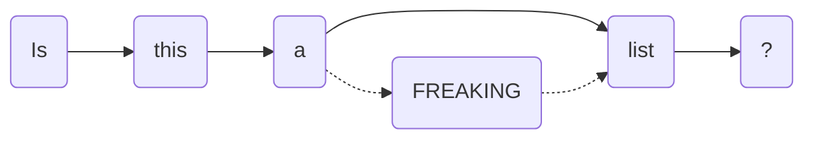

    <h1>ft_datalib</h1>
    
Porque las listas no son suficientes.

---

## I. Introducción

Las **estructuras de datos** son una parte fundamental de cualquier lenguaje de programación, y en este proyecto vas a aprender a implementarlas y a usarlas; concretamente, programarás *listas enlazadas*, *listas doblemente enlazadas*, *colas* y *pilas*.

Sin embargo, la verdadera finalidad de este proyecto no es programar estructuras de datos, sino **aprender a trabajar en equipo mediante el *Flujo de Trabajo de GitHub*** desarrollando el proyecto.

## II. Instrucciones generales

Este proyecto seguirá la misma dinámica que cualquier otro proyecto del campus (Norma, control de *leaks*...), con las siguientes excepciones:

**Se realizará en un equipo de 3 personas.**  
Tus compañeros serán aquellos que te acompañan en tu misma fila; si sois menos, *up2you*.

**Se debe aplicar el *Flujo de Trabajo de GitHub* al desarrollo.**  
Por supuesto, usando *projects*, *branches*, *issues*, *milestones* y *pull requests*.

**No se permite el uso de archivos adicionales en `master`, excepto si este es `.gitmodule`.**  
Tendréis que gestionar adecuadamente los archivos que se os proporcionan.

> El proyecto está diseñado para que sea lo suficientemente complejo como para que se necesite repartir el trabajo entre varias personas para cumplirlo en el tiempo disponible.

## III. Resultados esperados

**Un uso correcto de Git y GitHub durante el desarrollo del proyecto.**  
Este taller no trata sobre *lenguaje C*; así que lo importante no será el resultado final, sino el proceso.

Se espera un repositorio que contenga:

- *Commits* relevantes y estructurados.
- *Branches* bien definidas que reflejen trabajo en equipo.
- *Issues* y *milestones* que agrupen tareas.
- *Projects* que gestionen las tareas.
- *Pull requests* que reflejen la revisión de código.

**Aprendizaje sobre estructuras de datos.**  
Saber implementar y manejar estructuras de datos es algo increíblemente útil en cualquier lenguaje de programación.

> Si Git y GitHub era el plato principal, creo que esto es una buena ensalada.  
> Si eres vegetariano/a o vegano/a, *Git y GitHub* para ti son **otra** ensalada.

## III. Ejercicios

### 00 - Preparación

Votad democráticamente a un líder, dicho líder deberá:

- [ ] Hacer un *fork* de este repositorio.
- [ ] Invitar al resto del equipo como colaboradores.

### 01 - Planificación

¡Un momento! No hay prisa, pensemos las cosas antes de empezar a programar.

- [ ] Cread un *project* para organizar el trabajo con al menos 2 vistas: tablero y kanban.

Una vez hecho eso y cuando hayáis terminado de leer el *README*:

- [ ] Llenadlo de tareas como vosotros mismos decidáis, pero recordad los recursos de los que disponéis (*issues*, *milestones*...).

Y también, una regla extra, una muy pequeña, casi diminuta:  
**Ninguna estructura de datos debe estar completamente implementada por una sola persona**.  
¡Esto activará vuestras neuronas para *encajar* los cambios!

> \- Hola, Hal, ¿me recibes? ¿Me recibes, Hal?  
> \- Afirmativo, Dave. Te recibo.  
> \- Abre la puerta de la plataforma.  
> \- Lo siento, Dave. Me temo que no puedo.
>
> Extraído de *2001: Una Odisea del Espacio* (1968) de Stanley Kubrick.

### 02 - Implementación

Seguramente os estéis preguntando, "¿podemos programar ya?".

La respuesta rápida es que no, pero en realidad, es que sí.

#### 01 - El submódulo *Libft*

Muy posiblemente hayáis estado copiando-y-pegando vuestra librería *Libft* en vuestros proyectos, o peor aún, solo sus funciones; ahora ha llegado el momento de convertirnos en seres eficientes y usar un submódulo.

> *Una pena que a Moulinette no le gusten; pero bueno, es lo que hay.*

- [ ] Buscad una *Libft*, cualquier *Libft*, y añadidla al proyecto como un submódulo.

> **Consejo**  
> Revisad bien el contenido de este repositorio, sobre todo respecto a la *Libft*.  
> Quizaś os interese una *Libft* sin *bonus*... O no. Yo que sé, ni que esto fuera mío.

> Por otra parte, sí, el fichero `.gitmodule` puede añadirse cuando se genere.

#### 02 - Las estructuras de datos

Ya sí, por fin, ¡toca programar!

Implementad las siguientes estructuras de datos usando el código disponible en el repositorio:

- [ ] **Listas Enlazadas.**  
Seguro que las conoces, las viste en el proyecto *Libft*.  
Sin embargo, aquí serán un poco más simples y con otras funciones.

- [ ] **Listas Doblemente Enlazadas.**  
Porque las listas enlazadas no son suficientes.  
Aquí podrás moverte tanto hacia adelante como hacia atrás.

- [ ] **Colas.**  
Las listas enlazadas son útiles, pero no son colas.  
Funcionan con el principio *first in, first out (FIFO)*.  
No importa su contenido, solo el primer y último elemento.

- [ ] **Pilas.**  
Las colas son útiles, pero las pilas... ¡también!  
Funcionan con el principio *last in, first out (LIFO)*.  
No importa su contenido, solo el primer elemento.

## Evaluación

He estado hablando con HAL y me ha dicho que no hay forma de evaluar el proyecto, así que no hay evaluación.

*Sí obstante*, si queréis vacilar sobre *quién tiene la rama más larga*, siempre podréis pedírselo a otros de vuestros compañeros, ¡nadie os lo va a impedir!

---

# Bonus

- [ ] Implementad una estructura de datos extra: **los Conjuntos**.

> Efectivamente, estaban en el fichero de cabeceras **desde el principio**, ¡vaya *plot-twist*!
